# Resultados — Aplicação de Machine Learning para análise da qualidade da água na bacia do PCJ

Relatório de **resultados** do projeto de Iniciação Científica (IC, Guilherme). Segue a estrutura
metodológica do projeto (seções 3.1 a 3.5, ver pdf do projeto FAPESP), apresentando, para cada etapa, os
resultados obtidos, as figuras e tabelas correspondentes e a sua interpretação.

**Base de dados.** Boletins físico-químicos e bacteriológicos do SEMAE-Piracicaba
(água **bruta** do rio Piracicaba), série **2009–2024**. Cada página do PDF traz,
por mês, três estatísticas (`Mín./Méd./Máx.`). A **tabela de modelagem** usa a
estatística **`Méd.` mensal**, resultando em **192 observações** (16 anos × 12 meses)
× **23 variáveis** físico-químicas/bacteriológicas. Todos os modelos usam semente
fixa (`random_state=42`); figuras em `reports/figures/`, tabelas em `reports/tables/`.

---

## 3.1 Pré-processamento

### 3.1.1 Análise de dados faltantes e padrão de ausência

Calculou-se o percentual de faltantes por variável. A distribuição é fortemente
desigual: 7 variáveis têm **>30%** de ausências (medições esporádicas no boletim),
enquanto os parâmetros físico-químicos básicos têm <5%.

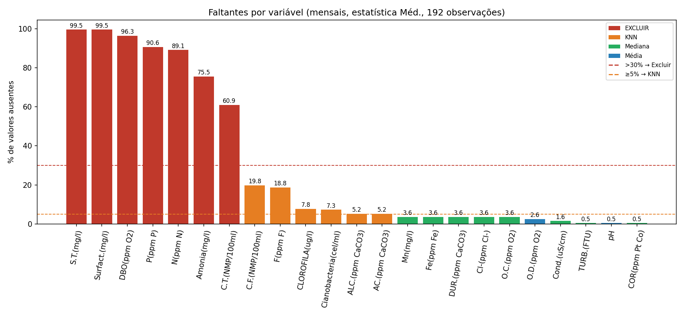
**Figura 1.** Percentual de valores ausentes por variável (192 meses). Sólidos
totais e surfactantes são quase nunca medidos (~99%); nutrientes (P, N) e amônia
ficam acima de 75%; pH, turbidez e cor têm <1%.

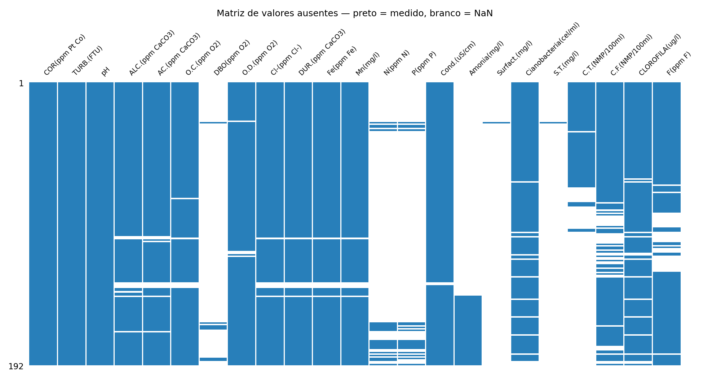
**Figura 2.** Matriz de ausência (linhas = meses, colunas = variáveis). Evidencia
que as ausências são **estruturais por período** — p. ex., N, P e amônia só passam
a ser medidos de forma regular a partir de ~2018–2021.

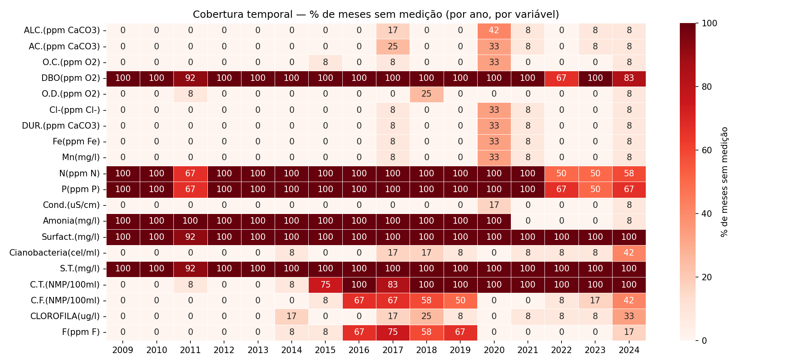
**Figura 3.** Cobertura temporal: quando cada variável passou a ser medida. Confirma
que a ausência **não é aleatória no tempo** (mudança de protocolo do laboratório).

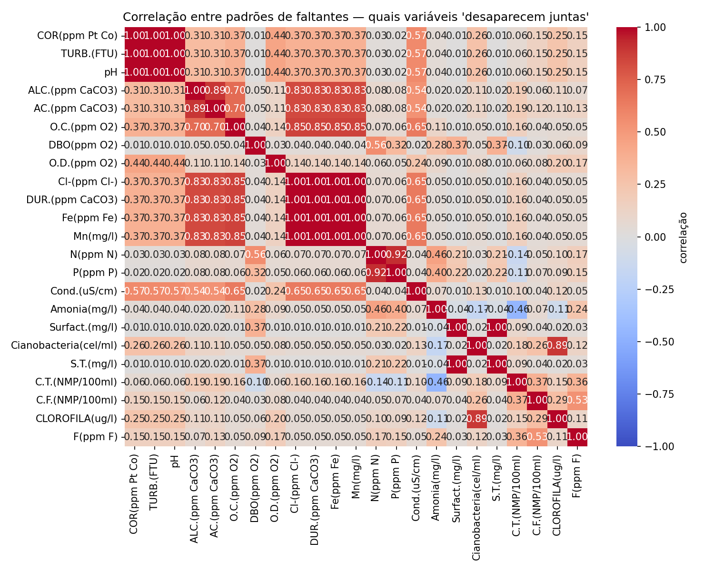
**Figura 4.** Correlação entre padrões de ausência: variáveis que “somem juntas”
(nutrientes e bacteriológicos), reforçando ausência por blocos de protocolo.

**Teste da hipótese MCAR (Little).** O projeto assume *Missing Completely At Random*.
O teste de Little resultou em **χ² ≈ 327,6 (gl = 269), p ≈ 0,008**. Como **p < 0,05**,
a hipótese MCAR é **rejeitada**: os faltantes **não** são completamente aleatórios —
coerente com as Figuras 2–3 (ausência ligada a mudança de protocolo, não a falha
aleatória de sensor). A imputação segue as regras declaradas no projeto, mas esta
limitação fica **registrada** para a interpretação dos resultados.

### 3.1.2 Decisão de tratamento por variável

Aplicou-se a árvore de decisão do projeto: **>30% → excluir**; **5–30% → KNN**
(k=5, `weights="distance"`, padronizado quando faltantes >15%); **<5% → média**
(simétrica) ou **mediana** (assimétrica, |skew|>1).

**Tabela 1.** Decisão de imputação por variável (ordenada por % de faltantes).

| Variável | % faltantes | skew | Decisão |
|---|---:|---:|---|
| S.T. (mg/L) | 99,5 | — | **EXCLUIR** |
| Surfact. (mg/L) | 99,5 | — | **EXCLUIR** |
| DBO (ppm O₂) | 96,4 | 2,64 | **EXCLUIR** |
| P (ppm P) | 90,6 | 0,45 | **EXCLUIR** |
| N (ppm N) | 89,1 | 3,83 | **EXCLUIR** |
| Amônia (mg/L) | 75,5 | 0,23 | **EXCLUIR** |
| C.T. (NMP/100mL) | 60,9 | 3,27 | **EXCLUIR** |
| C.F. (NMP/100mL) | 19,8 | 3,77 | KNN |
| F (ppm F) | 18,8 | 0,63 | KNN |
| CLOROFILA (µg/L) | 7,8 | 6,11 | KNN |
| Cianobactérias (cel/mL) | 7,3 | 3,64 | KNN |
| ALC. (ppm CaCO₃) | 5,2 | 1,80 | KNN |
| AC. (ppm CaCO₃) | 5,2 | 3,82 | KNN |
| Mn (mg/L) | 3,6 | 2,41 | Mediana |
| Fe (ppm Fe) | 3,6 | 2,67 | Mediana |
| DUR. (ppm CaCO₃) | 3,6 | 1,41 | Mediana |
| Cl⁻ (ppm Cl⁻) | 3,6 | 3,92 | Mediana |
| O.C. (ppm O₂) | 3,6 | 2,85 | Mediana |
| O.D. (ppm O₂) | 2,6 | 0,18 | **Média** |
| Cond. (µS/cm) | 1,6 | 1,52 | Mediana |
| TURB. (FTU) | 0,5 | 1,98 | Mediana |
| pH | 0,5 | 0,64 | **Média** |
| COR (ppm Pt Co) | 0,5 | 3,43 | Mediana |

**Resultado:** 7 variáveis excluídas e **16 mantidas** para modelagem. ⚠️ A regra
descarta justamente **N, P e amônia** (nutrientes), relevantes para irrigação —
conflito documentado; mitigação possível é um pipeline alternativo 2018–2024.

### 3.1.3 Validação da imputação (impacto no K-Means)

Além de comparar média/mediana/desvio antes e depois (sem distorções relevantes nas
16 mantidas), avaliou-se o **impacto da imputação na estrutura de clusters**
(coeficiente de silhueta), como pede o projeto.

**Tabela 2.** Impacto da imputação na silhueta do K-Means.

| Conjunto | n | melhor k | silhueta |
|---|---:|---:|---:|
| complete-case (sem imputar) | 126 | 3 | 0,203 |
| imputado (192 meses) | 192 | 2 | **0,279** |

A imputação **não degradou** a estrutura — a silhueta do conjunto imputado (0,279)
é até superior à do subconjunto complete-case (0,203), indicando que recuperar as
linhas com faltantes **reforçou** uma separação consistente em 2 grupos.

### 3.1.4 Padronização e correlação

Os dados foram padronizados com **StandardScaler** (média 0, desvio 1) para os
algoritmos sensíveis a escala (K-Means, KNN, LOF). A matriz de correlação de
**Pearson** identifica redundâncias entre variáveis.

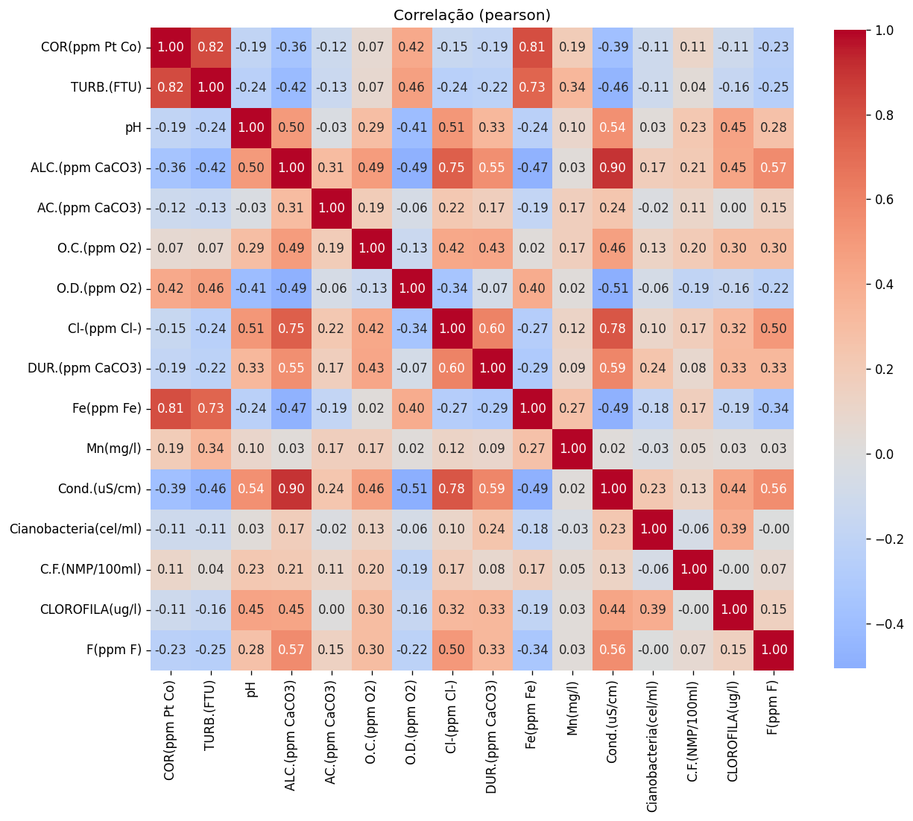
**Figura 5.** Correlação de Pearson entre as 16 variáveis mantidas. Destacam-se as
associações esperadas: dureza × condutividade × alcalinidade (mineralização conjunta)
e cor × turbidez (material particulado). Pares muito correlacionados são candidatos a
redundância na modelagem.

---

## 3.2 Análise exploratória de dados

A análise descritiva (média, mediana, desvio) e as visualizações por variável
subsidiam a detecção de outliers e a modelagem. Os boxplots padronizados (z-score)
permitem comparar variáveis em escalas muito diferentes na mesma figura.

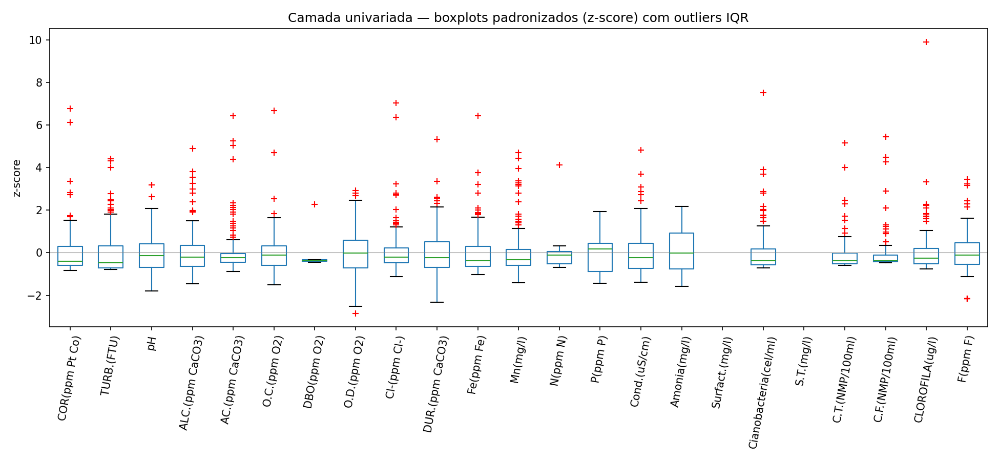
**Figura 6.** Boxplots padronizados (z-score) das 23 variáveis, com outliers do IQR
em vermelho. Variáveis fortemente assimétricas e com caudas longas (cor, ferro,
clorofila, coliformes) concentram a maioria dos pontos extremos — sinalizando os
parâmetros mais propensos a “picos” de qualidade.

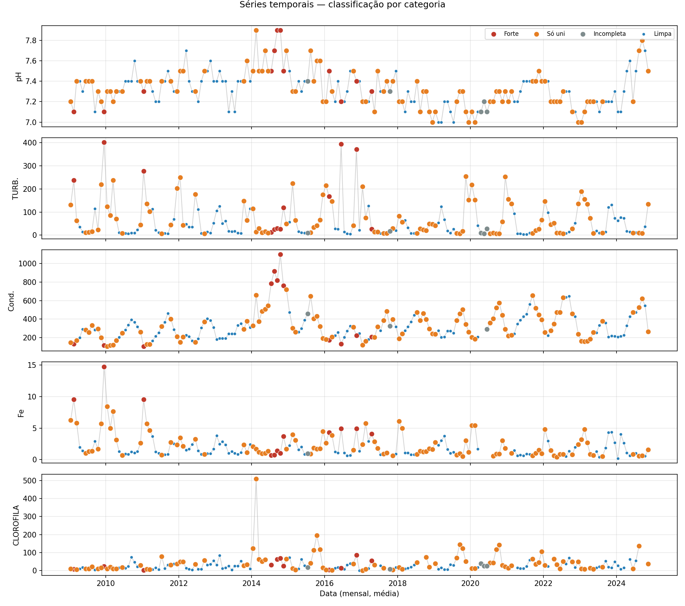
**Figura 7.** Séries temporais de variáveis-chave com os meses sinalizados por
categoria. Os picos se concentram em períodos específicos (ver §3.3).

---

## 3.3 Detecção de outliers — método tradicional vs. ensemble de ML

Comparou-se a regra tradicional **IQR** (e a variante robusta **MAD**) com o
**ensemble multivariado** (Isolation Forest + LOF + KNN, voto por maioria ≥2/3),
todos com `contamination = 0,07`, sobre a camada multivariada (10 variáveis com
≤5% de faltantes, 180 observações *complete-case*, padronizadas).

### 3.3.1 Comparação quantitativa entre métodos

**Tabela 3.** Comparação interna dos métodos de detecção (180 obs; sem rótulo
verdadeiro, usa-se calibração ao alvo de 7%, alinhamento com a crise do Cantareira
2014–2016 e concordância entre métodos).

| Método | nº flags | taxa | dist. calibração ↓ | recall crise | precisão crise | concordância |
|---|---:|---:|---:|---:|---:|---:|
| IQR | 91 | 0,474 | 0,404 | 0,639 | 0,253 | 0,265 |
| MAD | 96 | 0,500 | 0,430 | 0,667 | 0,250 | 0,259 |
| IForest | 13 | 0,068 | **0,002** | 0,222 | 0,615 | 0,484 |
| LOF | 13 | 0,068 | **0,002** | 0,250 | 0,692 | 0,484 |
| KNN | 13 | 0,068 | **0,002** | 0,222 | 0,615 | 0,534 |
| **Ensemble** | 12 | 0,063 | 0,008 | 0,222 | 0,667 | **0,550** |

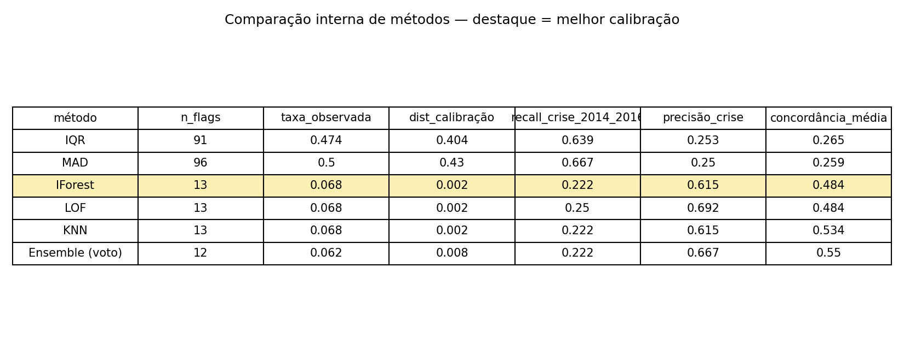
**Figura 8.** Tabela-resumo da comparação (destaque = melhor calibração). Os métodos
univariados (IQR/MAD) marcam ~25% das observações — muitas, com baixa precisão — pois
sinalizam a linha sempre que **uma única** variável é extrema. Os métodos
multivariados ficam **bem calibrados** (~7%) e mais precisos contra o evento conhecido.

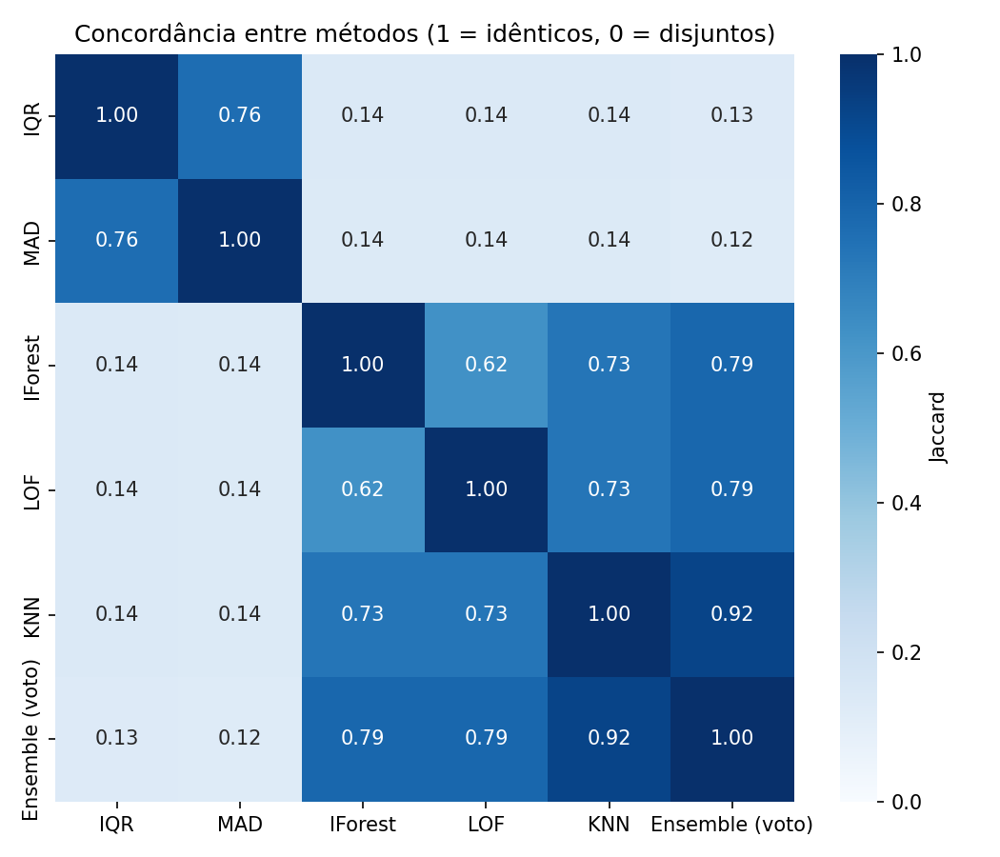
**Figura 9.** Matriz de Jaccard: os multivariados concordam fortemente entre si; IQR
e MAD formam um grupo à parte (muito sensível).

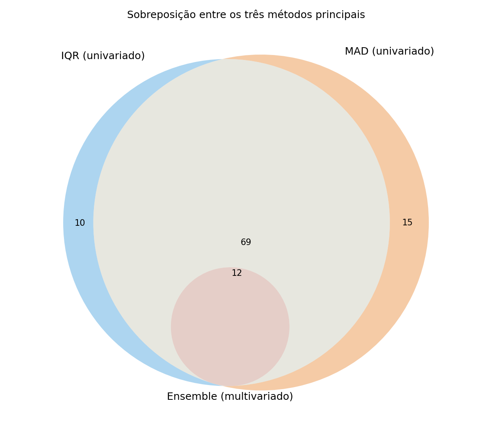
**Figura 10.** Sobreposição IQR ∪ MAD ∪ Ensemble — o ensemble é praticamente um
subconjunto “robusto” dos univariados.

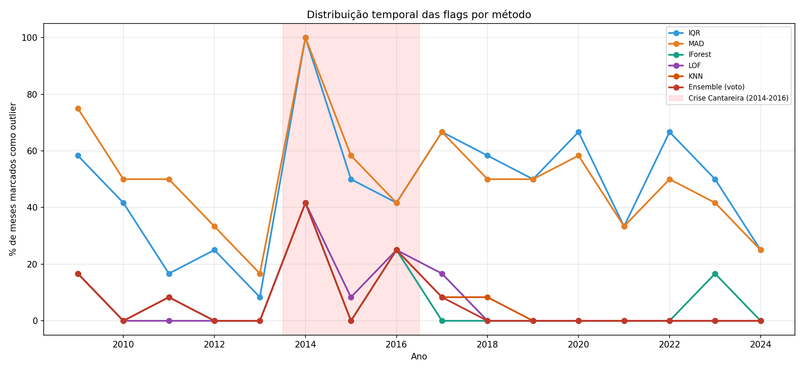
**Figura 11.** Percentual de meses marcados por ano. Há concentração de anomalias no
período da **crise do Cantareira (2014–2016)**, usado como validação externa empírica.

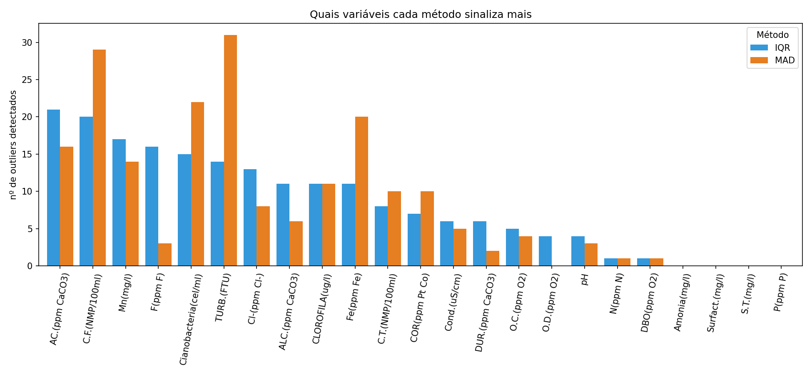
**Figura 12.** Heatmap variável × método: quais variáveis cada método mais “ataca”.

### 3.3.2 Detecção por método nos dados normalizados

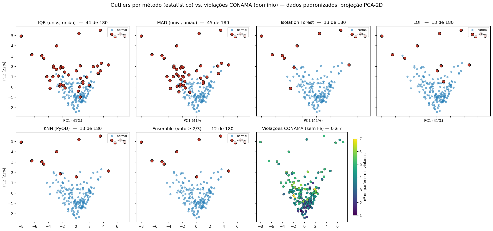
**Figura 13.** Detecção por método, projetada em PCA-2D (PC1+PC2 ≈ 63% da variância)
dos dados padronizados; 7º painel colore os pontos pelo nº de violações CONAMA (sem
Fe). IQR/MAD pintam de vermelho até o miolo da nuvem (univariados, agressivos);
IForest/LOF/KNN/Ensemble marcam apenas a **periferia** — onde também se concentram as
maiores cargas de não conformidade legal. Confirma a complementaridade das duas lentes.

### 3.3.3 Calibração de `contamination` por validação cruzada

O parâmetro `contamination` (faixa 0,05–0,1 do projeto) foi calibrado por
**estabilidade das flags entre folds** (Jaccard médio, proxy de robustez sem rótulo).

**Tabela 4.** Calibração de `contamination` (Isolation Forest, 5-fold).

| contamination | nº flags | taxa | estabilidade (Jaccard) |
|---:|---:|---:|---:|
| 0,05 | 9 | 0,050 | 0,770 |
| 0,06 | 11 | 0,061 | 0,800 |
| 0,07 | 13 | 0,072 | 0,808 |
| **0,08** | 15 | 0,083 | **0,818** |
| 0,09 | 17 | 0,094 | 0,772 |
| 0,10 | 18 | 0,100 | 0,771 |

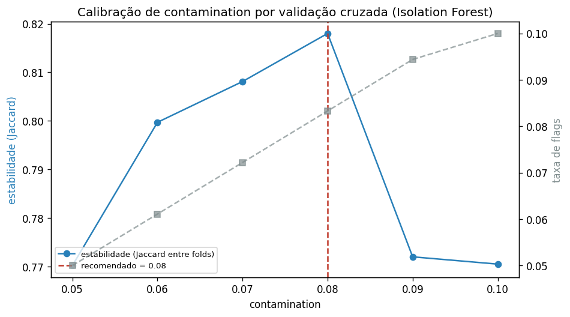
**Figura 14.** Estabilidade vs. `contamination`. O máximo de estabilidade ocorre em
**0,08** — escolha data-driven dentro da faixa do projeto, substituindo o valor
arbitrário de 0,07.

### 3.3.4 Outliers confirmados (consenso + domínio + evento)

Como não há *ground truth*, definiu-se **outlier confirmado** = marcado por **≥4 dos
6 métodos** **e** com **≥1 violação CONAMA 357/2005** (descontando o Ferro — ver nota).
Resultado: **12 de 180 observações**.

**Tabela 5.** Outliers confirmados (12 meses).

| Ano/Mês | nº métodos | viol. CONAMA | viol. sem Fe | Métodos |
|---|---:|---:|---:|---|
| 2009 Fev | 6 | 6 | 5 | todos |
| 2009 Dez | 6 | 6 | 5 | todos |
| 2014 Jul | 6 | 5 | 4 | todos |
| 2014 Ago | 6 | 5 | 4 | todos |
| 2014 Set | 6 | 6 | 5 | todos |
| 2014 Out | 6 | 6 | 5 | todos |
| 2014 Nov | 6 | 6 | 5 | todos |
| 2016 Fev | 6 | 5 | 4 | todos |
| 2016 Jun | 6 | 5 | 4 | todos |
| 2016 Nov | 6 | 6 | 5 | todos |
| 2011 Jan | 5 | 6 | 5 | IQR, MAD, IForest, KNN, Ensemble |
| 2017 Abr | 5 | 5 | 4 | IQR, MAD, LOF, KNN, Ensemble |

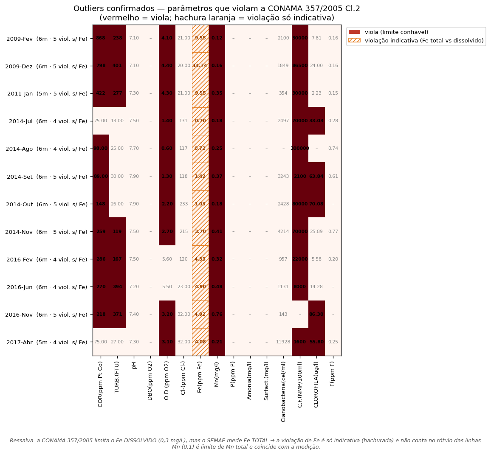
**Figura 15.** Parâmetros que cada outlier confirmado viola (vermelho), com o valor
medido anotado; a coluna **Fe é hachurada** (violação só *indicativa*, ver nota). Os
disparadores recorrentes são **cor, oxigênio dissolvido baixo, clorofila e coliformes**.

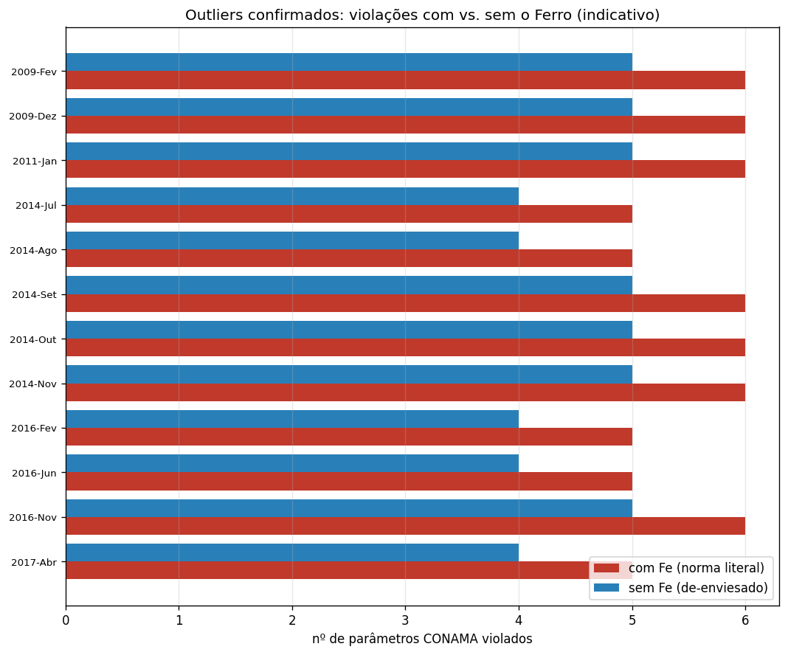
**Figura 16.** Violações **com** vs. **sem** o Ferro. Mesmo descontando o Fe, os 12
meses mantêm 4–5 violações reais: a confirmação **não depende** do parâmetro enviesado.

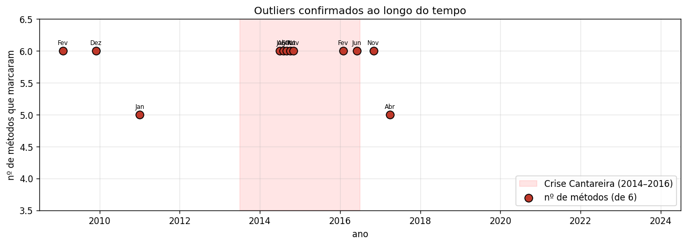
**Figura 17.** Distribuição temporal dos confirmados: **8 dos 12** caem em 2014/2016
(crise do Cantareira) — convergência entre estatística, norma legal e evento histórico.

> **Nota sobre o Ferro.** A CONAMA 357/2005 limita o Fe **dissolvido** (0,3 mg/L), mas
> o SEMAE mede Fe **total** → as violações de Fe estão **superestimadas** e foram
> tratadas como *indicativas*. O Manganês (0,1) é limite de Mn **total** e coincide
> com a medição (sem viés). Limites verificados contra os Art. 14 e 15 da Resolução.

---

## 3.4 Modelagem com Machine Learning

### 3.4.1 K-Means (agrupamento)

Testou-se `n_clusters` de 2 a 10. O número de clusters foi escolhido pela silhueta
(máxima em **k=2**), com o método do cotovelo como apoio (joelho em k≈3).

**Tabela 6.** Varredura de k (WCSS e silhueta).

| k | WCSS | silhueta |
|---:|---:|---:|
| **2** | 2492,2 | **0,279** |
| 3 | 2084,9 | 0,227 |
| 4 | 1969,9 | 0,165 |
| 5 | 1861,5 | 0,130 |
| 6 | 1737,5 | 0,115 |
| 7 | 1708,3 | 0,099 |
| 8 | 1551,7 | 0,115 |
| 9 | 1506,5 | 0,111 |
| 10 | 1381,6 | 0,115 |

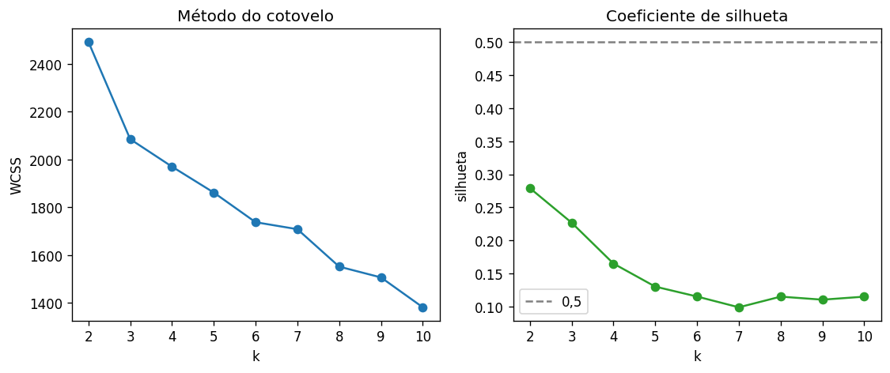
**Figura 18.** Método do cotovelo (WCSS) e coeficiente de silhueta vs. k. A silhueta
máxima (0,279) fica **abaixo de 0,5** — clusters existem, mas com separação moderada
(esperado em série ambiental contínua).

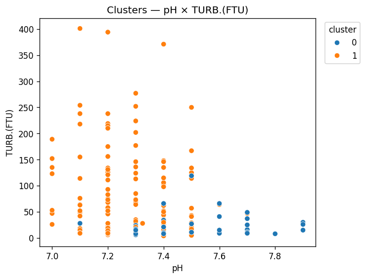
**Figura 19.** Dispersão pH × turbidez colorida por cluster — inspeção visual da
separação.

**Tabela 7.** Perfil dos clusters (média de cada variável por grupo).

| Variável | Cluster 0 (n=42) | Cluster 1 (n=150) |
|---|---:|---:|
| COR (ppm Pt Co) | 76,6 | 132,5 |
| TURB. (FTU) | 20,8 | **75,3** |
| pH | 7,50 | 7,28 |
| ALC. (ppm CaCO₃) | **96,9** | 53,9 |
| O.C. (ppm O₂) | 10,7 | 7,9 |
| O.D. (ppm O₂) | 2,55 | 3,28 |
| Cl⁻ (ppm Cl⁻) | **72,1** | 36,8 |
| DUR. (ppm CaCO₃) | **69,8** | 49,4 |
| Cond. (µS/cm) | **548,3** | 264,9 |
| Cianobactérias (cel/mL) | **20.799** | 7.873 |
| CLOROFILA (µg/L) | **81,2** | 25,3 |

**Interpretação.** O K-Means separa dois **regimes de qualidade** pelo eixo
mineralização × turbidez:
- **Cluster 0 (22%, n=42)** — água **mineralizada e eutrofizada**: alta condutividade
  (548 µS/cm), alcalinidade, dureza, cloreto, clorofila e cianobactérias, com **baixa
  turbidez** (20,8 FTU). É **mais frequente no período seco** (64% das suas amostras),
  quando há concentração de solutos e floração de algas.
- **Cluster 1 (78%, n=150)** — água **turva e diluída**: alta turbidez (75,3 FTU) e cor,
  baixa condutividade (265 µS/cm); distribui-se quase igualmente entre as estações
  (54% úmida, 46% seca).

A associação com a sazonalidade é **moderada, não determinística** — ambos os regimes
ocorrem nas duas estações (cluster 0: 64% seca / 36% úmida; cluster 1: 46% / 54%) —,
mas o contraste mineralização × turbidez é nítido e operacionalmente útil: o regime
turvo exige filtragem; o eutrofizado pede atenção a algas/cianotoxinas e a entupimento
biológico de emissores.

### 3.4.2 Random Forest (classificação)

**Rótulo.** O rótulo estrito CONAMA (“viola qualquer parâmetro”) é **degenerado** em
água bruta (as 192 amostras seriam “inadequadas”, pois a norma classifica o corpo
d’água, não a água tratada). Adotou-se então a **severidade** = nº de parâmetros
violados binarizado pela mediana → classes **baixa (126)** e **alta (66)**. Para evitar
*data leakage*, as variáveis usadas na regra de rótulo foram **removidas das features**;
o classificador usa apenas as 5 **não normatizadas**: ALC, AC, O.C., DUR, Cond.
Split 80/20 estratificado, `n_estimators=100`, `max_depth=10`, `class_weight="balanced"`,
validação cruzada k=5.

**Tabela 8.** Métricas do Random Forest (conjunto de teste).

| Acurácia | Precisão | Recall | F1 | CV-F1 (k=5) |
|---:|---:|---:|---:|---:|
| 0,692 | 0,600 | 0,231 | 0,333 | 0,472 |

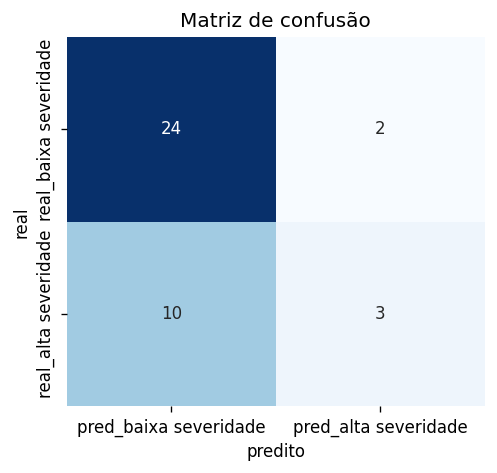
**Figura 20.** Matriz de confusão. De 13 meses de **alta severidade** no teste, o
modelo acerta 3 (recall 0,23) e perde 10 — modelo **conservador**: boa precisão (0,60),
baixa sensibilidade. Esperado, pois apenas 5 variáveis não normatizadas tentam prever
uma severidade governada por outras (cor, OD, clorofila…).

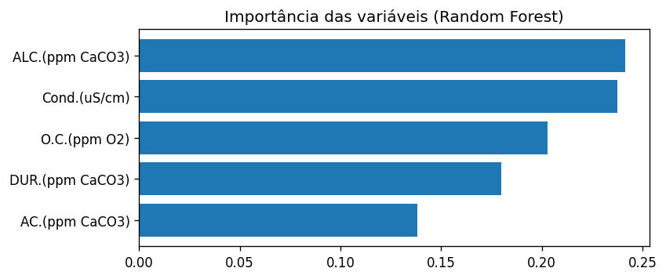
**Figura 21.** Importância das variáveis. **Alcalinidade (0,24)** e **condutividade
(0,24)** lideram, seguidas de oxigênio consumido (0,20), dureza (0,18) e acidez (0,14)
— ou seja, o grau de **mineralização** da água é o melhor preditor (indireto) da
severidade de não conformidade.

### 3.4.3 Isolation Forest (detecção de anomalias)

Aplicado às 192 observações padronizadas, com `contamination` calibrado.

**Resultado:** **taxa de anomalias = 0,073 (14 de 192 meses)**. As anomalias coincidem
com os picos identificados em §3.3 (eventos de 2014/2016 e picos de cor/ferro de 2009).

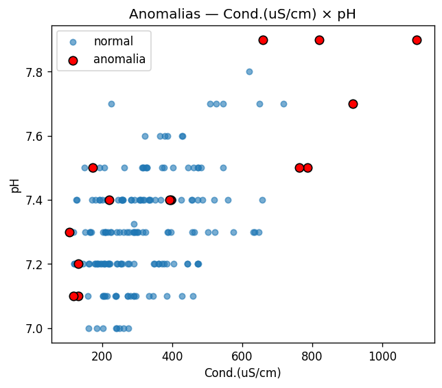
**Figura 22.** Dispersão com as anomalias (vermelho) destacadas — inspeção qualitativa
de eventos críticos (picos de mineralização e de material particulado).

---

## 3.5 Validação consolidada

**Tabela 9.** Síntese quantitativa dos três modelos.

| Modelo | Métrica principal | Valor | Leitura |
|---|---|---:|---|
| K-Means | silhueta (k=2) | 0,279 | 2 regimes (turvo/diluído × mineralizado/eutrofizado); separação moderada |
| Random Forest | F1 / acurácia | 0,333 / 0,692 | preditor conservador; mineralização explica parte da severidade |
| Isolation Forest | taxa de anomalias | 0,073 | 14 meses críticos, alinhados à crise 2014–2016 |
| Outliers (ensemble) | nº confirmados | 12/180 | consenso + violação CONAMA + evento histórico |
| `contamination` | calibrado (CV) | 0,08 | estabilidade Jaccard 0,818 |
| Imputação | silhueta imp. vs CC | 0,279 vs 0,203 | imputação preservou a estrutura |
| MCAR (Little) | p-valor | 0,008 | MCAR rejeitado (ausência não aleatória) |

**Convergência das evidências.** Os três caminhos independentes — agrupamento
(K-Means), detecção estatística (ensemble/Isolation Forest) e checagem regulatória
(CONAMA) — **apontam para os mesmos períodos críticos** (sobretudo 2014–2016), o que
dá robustez ao diagnóstico. Para o manejo de irrigação na bacia PCJ, os resultados
indicam dois regimes operacionais distintos e um conjunto pequeno e bem caracterizado
de meses de risco, úteis para priorizar monitoramento e prevenção de entupimentos.

---

## Limitações dos resultados

- **MCAR rejeitado:** a imputação assume aleatoriedade que os dados não confirmam;
  recomenda-se análise de sensibilidade.
- **Nutrientes excluídos:** N, P e amônia (>30% faltantes) saíram da modelagem, apesar
  de relevantes para irrigação — um pipeline 2018–2024 os recuperaria.
- **Ferro total × dissolvido:** violações de Fe são apenas indicativas (tratadas como tal).
- **Random Forest conservador:** baixo recall; rótulo de severidade é um *proxy* da
  aptidão real para irrigação (a CONAMA 357 não é específica para uso agrícola — ver
  FAO 29 / Ayers & Westcot como complemento futuro).
- **Água bruta:** os limites CONAMA classificam o corpo d’água, não a água tratada;
  por isso a leitura é de *severidade relativa*, não de aptidão absoluta.

---

## Referências

ABADI, H.T.; ALEMAYEHU, T.; BERHE, B. Assessing the suitability of water for irrigation purposes using irrigation water quality indices in the Irob catchment, Tigray, Northern Ethiopia. *Water Quality Research Journal*, v.60, n.1, p.177-195, 2024.

AGGARWAL, C.C. *Outlier Analysis*. 2.ed. Springer Cham, 2017. 466p. https://doi.org/10.1007/978-3-319-47578-3

ALIYU, T. et al. Assessment of the presence of metals and quality of water used for irrigation in Kwara State, Nigeria. *Pollution*, v.3, n.3, p.461-470, 2017.

AMINIYAN, M.M. et al. Evaluation of multiple water quality indices for drinking and irrigation purposes for the Karoon river, Iran. *Environ. Geochem. Health*, v.40, n.6, p.2707-2728, 2018.

ANA (Agência Nacional de Águas e Saneamento Básico). *PCJ*. 2024.

ANA (Agência Nacional de Águas e Saneamento Básico). *Atlas irrigação: uso da água na agricultura irrigada*. 2.ed. Brasília: ANA, 2021. 130p.

AYERS, R.S. et al. *Water Quality for Agriculture*. FAO: Rome, 1985. v.29.

BIAU, G.; SCORNET, E. A random forest guided tour. *Test*, v.25, n.2, p.197–227, 2016.

BRASIL. Conselho Nacional do Meio Ambiente (CONAMA). **Resolução nº 357, de 17 de março de 2005** — Classificação dos corpos de água doce (Art. 14 — Classe 1; Art. 15 — Classe 2). *Diário Oficial da União*, Brasília, DF, 2005.

CONGALTON, R.G. A review of assessing the accuracy of classifications of remotely sensed data. *Remote Sensing of Environment*, v.37, n.1, p.35-46, 1991.

CORDEIRO, G.G. *Qualidade de água para fins de irrigação*. Petrolina: Embrapa Semiárido, 2001. 32p. (Documentos; 167).

COX, D. et al. *Greenhouse Crops and Floriculture Program*. University of Massachusetts Amherst, 2015.

EGBUERI, J.C. et al. A multi-criteria water quality evaluation for human consumption, irrigation and industrial purposes in Umunya area, southeastern Nigeria. *Int. J. Environ. Anal. Chem.*, v.103, p.3351–3375, 2023.

GARCÍA-TEJERO, I.F. et al. Assessing plant water status in a hedgerow olive orchard from thermography at plant level. *Agricultural Water Management*, v.188, p.50-60, 2017.

HAMZAH, F.B. et al. Imputation methods for recovering streamflow observation: a methodological review. *Cogent Environmental Science*, v.6, n.1, 1745133, 2020.

JADHAV, A. et al. Consequences of irrigation water and soil quality: an overview. *Asian Journal of Soil Science and Plant Nutrition*, v.11, n.1, p.435–453, 2025.

JAIN, A.K.; DUBES, R.C. *Algorithms for Clustering Data*. Prentice Hall, 1988. 320p.

JORDANOV, I.; TARASSOV, E. K-nearest neighbors imputation for missing data in datasets. *2019 IEEE International Conference on Information Technologies (InfoTech-2019)*, p.1–4, 2019.

KAUFMAN, L.; ROUSSEEUW, P.J. *Finding Groups in Data: An Introduction to Cluster Analysis*. New York: John Wiley, 1990. 788p.

LEPOT, M. et al. Interpolation in time series: an introductory overview of existing methods, their performance criteria and uncertainty assessment. *Water*, v.9, n.10, p.796, 2017.

LIU, F.T.; TING, K.M.; ZHOU, Z.-H. Isolation Forest. *2008 Eighth IEEE International Conference on Data Mining*, p.413–422, 2008.

MACHADO, R.; LOPES, T.; DUARTE, S. Projected climate and land-use change impacts on streamflow: the case study of Piracicaba basin – Brazil. *International Journal of River Basin Management*, p.1–16, 2025.

MORGENTHALER, S. Exploratory data analysis. *Wiley Interdisciplinary Reviews: Computational Statistics*, v.1, n.1, p.33-44, 2009.

MUNIZ, G.L. et al. Influence of suspended solid particles on calcium carbonate fouling in dripper labyrinths. *Agricultural Water Management*, v.273, art. 107890, 2022.

PCJ. *Agência das Bacias PCJ*. 2024.

PEDREGOSA, F. et al. Scikit-learn: Machine Learning in Python. *Journal of Machine Learning Research*, v.12, p.2825–2830, 2011.

POWERS, D.M.W. Evaluation: from precision, recall and F-measure to ROC, informedness, markedness and correlation. *Journal of Machine Learning Technologies*, v.2, n.1, p.37-63, 2020.

ROUSSEEUW, P.J. Silhouettes: a graphical aid to the interpretation and validation of cluster analysis. *Journal of Computational and Applied Mathematics*, v.20, p.53–65, 1987.

SILVA, R.F. et al. A Data-Driven Method for Water Quality Analysis and Prediction for Localized Irrigation. *AgriEngineering*, v.6, n.2, p.1771-1793, 2024.

TROYANSKAYA, O. et al. Missing value estimation methods for DNA microarrays. *Bioinformatics*, v.17, n.6, p.520-525, 2001.

ZHAO, Y. et al. PyOD: A Python Toolbox for Scalable Outlier Detection. *Journal of Machine Learning Research*, v.20, n.96, p.1-7, 2020.

ZHAO, Y. et al. COPOD: Copula-Based Outlier Detection. *IEEE International Conference on Data Mining (ICDM)*, 2020.

---

*Resultados gerados pelos scripts `run_preprocess.py`, `run_train.py`, `run_evaluate.py`,
`run_outliers.py` e `calibrar_contamination.py`. Figuras em `reports/figures/`,
tabelas em `reports/tables/` e `data/interim/`. Detalhamento metodológico em
`docs/metodologia.md`.*
